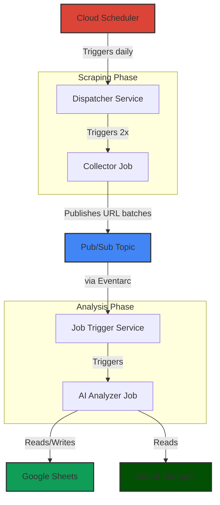

<div align="center">
<h1 align="center">Job Scout Pro</h1>
<p align="center">
<strong>An automated, end-to-end pipeline that scrapes job postings from JobRight.ai, uses Google's Gemini AI to analyze and filter them against a personal resume, and logs the best matches to a Google Sheet for tracking.</strong>
<br />
<br />
<span>This system is designed to run on a daily schedule, completely automating the tedious process of finding relevant job opportunities.</span>
<br />
<br />
</p>
</div>

## 🔧 Setup & Deployment

Follow these steps to deploy the entire system with a single command.

### Prerequisites

Before you begin, ensure you have the following:

1.  **Google Cloud Account**: A GCP account with billing enabled.
2.  **Google Cloud Project**: A new or existing project. Note your **Project ID**.
3.  **gcloud CLI**: The [Google Cloud SDK](https://cloud.google.com/sdk/docs/install) installed and authenticated (`gcloud auth login`).
5.  **JobRight.ai Account**: A valid email and password for JobRight.ai.
6.  **Google Sheet**: A Google Sheet set up for tracking. Here's the one I reccommend using (I also use it): [Sheet](https://docs.google.com/spreadsheets/d/1swOY-SNqPLy513ED3oEw9KXv62yQo4vp2FJWjyqrj_A/edit?usp=sharing)
Whatever sheet you end up using, make sure it has an **applications** tab in it.
7.  **Resume File**: Your resume in LaTeX or text format (`.tex/.txt`).

### Deployment Steps

1.  **Clone the Repository**
    ```bash
    git clone https://github.com/rkhatta1/JobScoutPro.git
    cd JobScoutPro
    ```

2.  **Configure Environment Variables**
    
    Copy the example environment file and fill in your specific values.
    ```bash
    cp .example.env .env
    ```

4.  **Run the Deployment Script**
    
    Make the script executable and run it.
    ```bash
    chmod +x deploy.sh
    ./deploy.sh
    ```
    The script will provision all the necessary resources, set permissions, and deploy the services and jobs. This may take several minutes.

### Post-Deployment Steps

After the `deploy.sh` script finishes successfully, you must complete one final manual step:

**Share your Google Sheet with the AI Analyzer's service account.**

1.  The script will output the service account email, which looks like this:
    `ai-analyzer-sa@<YOUR_PROJECT_ID>.iam.gserviceaccount.com`
2.  Open your Google Sheet.
3.  Click the "Share" button.
4.  Paste the service account email into the sharing dialog.
5.  Assign it the **Editor** role.
6.  Have ✅ **Notify people** checked
7.  Click "Send".

Your system is now fully configured and will run on the defined schedule!

## ✨ Features

-   **Automated Daily Scraping**: Runs on a schedule to find the latest job postings.
-   **Parallel Processing**: Scrapes jobs using multiple parallel instances for speed.
-   **AI-Powered Analysis**: Leverages the Gemini 2.0 Flash model to read job descriptions and evaluate them against your resume's skills and experience.
-   **Smart Deduplication**: Prevents duplicate job entries both within a single run and against jobs already in your tracker.
-   **Centralized Tracking**: Automatically logs all qualified job leads to a Google Sheet.
-   **One-Click Deployment**: A single shell script handles the entire Google Cloud setup, including services, jobs, permissions, and scheduling.
-   **Serverless & Scalable**: Built entirely on Google Cloud's serverless offerings (Cloud Run, Eventarc, Pub/Sub).

## 🏗️ Architecture

The system is a decoupled, event-driven pipeline running on Google Cloud:



1.  **Cloud Scheduler**: Kicks off the entire process on a defined schedule (e.g., 9 AM on weekdays).
2.  **Dispatcher (Cloud Run Service)**: A lightweight HTTP service that receives the trigger. Its sole job is to start two parallel executions of the `Collector Job`.
3.  **Collector (Cloud Run Job)**: Two instances of a Selenium-based scraper run simultaneously. Each instance logs into JobRight.ai, loads 150 jobs, and scrapes a designated half of the list (e.g., jobs 1-75 and 76-150). The collected URLs are published in batches to a Pub/Sub topic.
4.  **Pub/Sub & Eventarc**: The `scraped-urls` topic receives the URL batches. An Eventarc trigger listens to this topic and fires an event for each new message.
5.  **Job Trigger (Cloud Run Service)**: This service receives the Eventarc event, extracts the URL batch from the Pub/Sub message, and triggers a new `AI Analyzer Job`, passing the URLs as arguments.
6.  **AI Analyzer (Cloud Run Job)**: This is the core of the intelligence. It fetches your resume and API keys from Secret Manager, sends the job URLs and your resume to the Gemini API for analysis, deduplicates the results against existing entries in Google Sheets, and finally logs the new, unique, qualified jobs to your sheet.


## ⚙️ Configuration & Hardcoded Values

Several values are hardcoded in the scripts for simplicity. If you need to tweak the system's behavior, you can modify them here:

-   **`collector_job/scraper.py`**:
    -   `load_jobs(target_count=150)`: The total number of jobs to load from the infinite scroll list.
    -   `scrape_jobs(max_jobs=150)`: The total number of jobs to process.
-   **`collector_dispatcher/dispatcher.py`**:
    -   `job_configs`: Defines how many collector instances to run and how to split the work. Currently configured for 2 instances processing 75 jobs each.
-   **`ai_job/ai_analyzer.py`**:
    -   `chunk_list(urls_to_process, 5)`: The number of URLs sent to the Gemini API in a single request. Kept small to avoid context length issues and improve reliability.